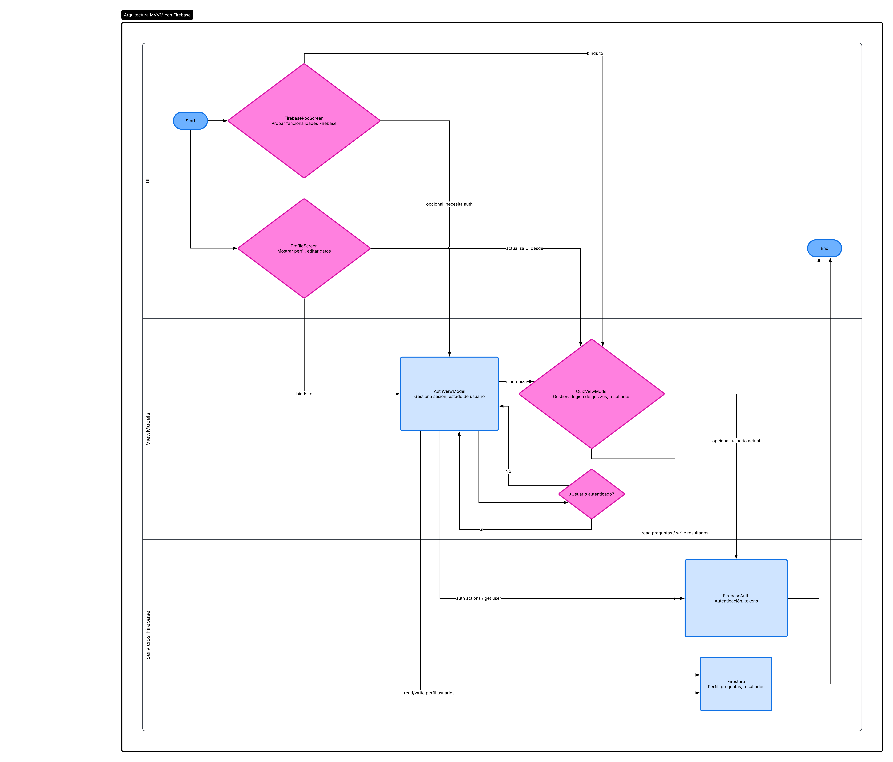
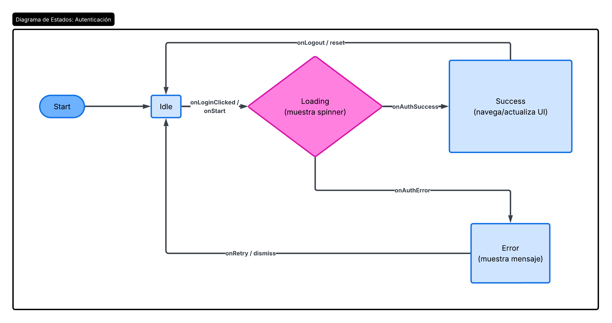
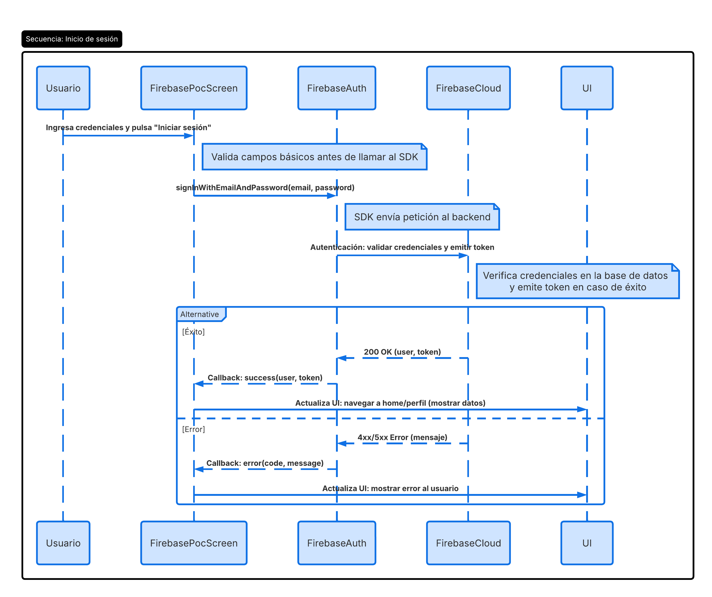

# POC - Firebase Authentication en StudyPlay

## Contexto

StudyPlay requiere validar la viabilidad de integrar servicios cloud para futuras funcionalidades del sistema, como autenticación de usuarios, almacenamiento de progreso y sincronización de datos entre dispositivos.

Como primera aproximación tecnológica, se decidió realizar una Proof of Concept (PoC) utilizando Firebase Authentication con autenticación anónima en una aplicación Flutter existente.

El objetivo principal es comprobar:
- conectividad con servicios cloud,
- integración cliente-servidor,
- manejo de autenticación,
- uso de operaciones asíncronas,
- viabilidad técnica de Firebase dentro de la arquitectura del proyecto.

---

# Decisión

Se implementó Firebase Authentication utilizando autenticación anónima (`signInAnonymously`) dentro de una pantalla independiente llamada `FirebasePocScreen`.

La solución incluye:
- integración de Firebase Core,
- autenticación mediante Firebase Auth,
- inicialización de Firebase en Flutter,
- manejo de estados reactivos,
- navegación hacia la PoC desde ProfileScreen,
- feedback visual de estados de autenticación.

La arquitectura implementada considera:
- UI Flutter,
- ViewModels con Provider,
- servicios cloud de Firebase.

---

# Implementación

## Tecnologías utilizadas

| Tecnología | Uso |
|---|---|
| Flutter | Framework principal |
| Firebase Core | Inicialización Firebase |
| Firebase Auth | Autenticación |
| Provider | Manejo de estado |
| Dart Async/Await | Operaciones asíncronas |

---

# Flujo implementado

1. Usuario accede a FirebasePocScreen.
2. Usuario presiona botón "Login Firebase".
3. La aplicación ejecuta `FirebaseAuth.instance.signInAnonymously()`.
4. Firebase valida la autenticación.
5. Se retorna un usuario autenticado anónimo.
6. La interfaz actualiza el estado mostrando éxito o error.

---

# Resultados obtenidos

La PoC fue exitosa.

Se logró:
- conectar Flutter con Firebase,
- autenticar usuarios anónimos,
- visualizar usuarios autenticados en Firebase Console,
- manejar estados reactivos,
- implementar navegación funcional,
- validar integración cloud.

---

# Consecuencias

## Positivas

- Firebase es compatible con la arquitectura actual.
- Provider funciona correctamente con operaciones async.
- La integración cloud es viable para futuras expansiones.
- La autenticación puede escalar a Google Login o Email/Password.

## Negativas

- Dependencia externa de Firebase.
- Requiere configuración multiplataforma.
- Necesita manejo futuro de seguridad y reglas cloud.

---
## Diagrama de Arquitectura

---

## Diagrama de Estados

---

## Diagrama de Secuencia

# Conclusión

La Proof of Concept confirma que Firebase Authentication es una solución técnicamente viable para StudyPlay.

La integración demostró:
- conectividad estable,
- arquitectura compatible,
- soporte para asincronía,
- facilidad de expansión futura.

Se recomienda continuar utilizando Firebase para futuras funcionalidades cloud del proyecto.