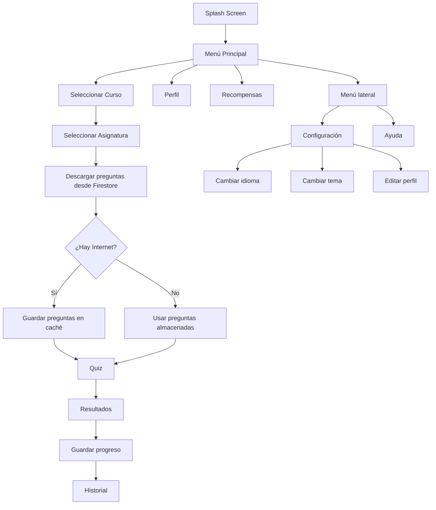

# STUDYPLAY
### Motivar el aprendizaje mediante una experiencia interactiva y gamificada, facilitando el estudio en distintas áreas académicas.

StudyPlay es una aplicación móvil que transforma el aprendizaje en una experiencia interactiva mediante gamificación. Permite a los usuarios estudiar a través de trivias dinámicas, obtener recompensas y mejorar sus hábitos de estudio en cualquier lugar, abordando la desmotivación del aprendizaje tradicional mediante el uso de puntos, logros y progreso visual.

---

## CARACTERÍSTICAS PROPIAS DEL MÓVIL

* Notificaciones locales programadas.
* Acceso ubicuo (uso en cualquier momento y lugar).
* Interfaz táctil intuitiva.
* Interacción dinámica mediante quizzes.
* Navegación fluida entre pantallas.
* Uso de recursos visuales (iconos, imágenes y tarjetas).
* Efectos de sonido y vibración.
* Selección de imagen de perfil desde la galería.
* Detección automática de conexión a Internet.
* Funcionamiento offline utilizando caché local.

---

## HISTORIAS DE USUARIO

* Como estudiante, quiero responder quizzes para practicar mis conocimientos.
* Como estudiante, quiero recibir recordatorios para estudiar.
* Como estudiante, quiero ganar logros para motivarme.
* Como estudiante, quiero revisar mi historial de partidas.
* Como estudiante, quiero ver mi perfil y progreso.
* Como estudiante, quiero seleccionar el curso en el que estoy para responder preguntas acordes a mi nivel.
* Como estudiante, quiero continuar utilizando la aplicación aunque pierda conexión a Internet.
* Como estudiante, quiero cambiar el idioma de la aplicación.
* Como estudiante, quiero iniciar sesión para guardar mi progreso en la nube.

---

## REQUERIMIENTOS FUNCIONALES (RF)

* RF1: El sistema debe permitir responder quizzes.
* RF2: El sistema debe mostrar resultados al finalizar.
* RF3: El sistema debe registrar el historial de partidas.
* RF4: El sistema debe mostrar logros y recompensas.
* RF5: El sistema debe permitir navegación entre pantallas.
* RF6: El sistema debe mostrar información del perfil del usuario.
* RF7: El sistema debe mostrar ayuda y soporte.
* RF8: El sistema debe permitir iniciar y cerrar sesión.
* RF9: El sistema debe guardar configuraciones personalizadas.
* RF10: El sistema debe permitir cambiar la foto de perfil.
* RF11: El sistema debe almacenar respuestas de encuestas en Firebase.
* RF12: El sistema debe permitir seleccionar el curso del estudiante.
* RF13: El sistema debe cargar preguntas desde Firebase Firestore.
* RF14: El sistema debe almacenar preguntas localmente para uso offline.
* RF15: El sistema debe sincronizar automáticamente la información al recuperar la conexión.
* RF16: El sistema debe permitir cambiar el idioma entre español e inglés.
* RF17: El sistema debe mostrar preguntas aleatorias al repetir una asignatura completada.

---

## REQUERIMIENTOS NO FUNCIONALES (RNF)

* RNF1: La aplicación debe ser responsiva.
* RNF2: Debe funcionar en Android.
* RNF3: La interfaz debe ser intuitiva.
* RNF4: Tiempo de respuesta rápido.
* RNF5: Arquitectura escalable y modular.
* RNF6: Persistencia de datos entre sesiones.
* RNF7: Compatibilidad con Firebase.
* RNF8: La aplicación debe funcionar sin conexión utilizando la última información descargada.
* RNF9: La sincronización con Firestore debe realizarse de manera asíncrona.
* RNF10: Debe soportar internacionalización.

---

## ARQUITECTURA Y PATRONES

La aplicación sigue una estructura modular:

lib/
├── controller/
├── data/
├── models/
├── services/
├── ui/
│   ├── screens/
│   └── widgets/
├── utils/
├── viewmodels/
└── main.dart

## Patrón MVVM
* Model: Representa los datos y entidades del sistema.
* View: Pantallas e interfaces gráficas.
* ViewModel: Gestiona la lógica y el estado de la aplicación.

## Gestión de estado

Se utiliza Provider para:

* Compartir datos entre pantallas.
* Actualizar la interfaz automáticamente.
* Gestionar el estado global de la aplicación.

## Persistencia local

Se utiliza SharedPreferences para almacenar:

* Curso seleccionado.
* Nombre del usuario.
* Edad.
* País.
* Foto de perfil.
* Configuración de sonido.
* Configuración de notificaciones.
* Tema oscuro.
* Idioma seleccionado.
* Usuario actual.
* Progreso del jugador.
* Historial.
* Caché de preguntas descargadas desde Firestore.

## Persistencia en la nube

Se utiliza Firebase como Backend as a Service (BaaS):

### Firebase Authentication

* Registro mediante correo electrónico.
* Inicio de sesión.
* Mantención de sesión.
* Cambio de cuenta.

### Cloud Firestore

* Preguntas organizadas por:
  * Curso (1° a 6° básico)
  * Asignatura
  * Nivel
* Historial de partidas.
* Progreso del usuario.
* Configuración.
* Encuestas de calidad.
* Encuestas de satisfacción.

Las preguntas se descargan de forma asíncrona y se almacenan automáticamente en caché para permitir jugar sin conexión.

---

## TECNOLOGÍAS UTILIZADAS

### Framework
* Flutter
* Dart
### Gestión de estado
* Provider
### Base de datos y autenticación
* Firebase Core
* Firebase Authentication
* Cloud Firestore
### Persistencia local
* SharedPreferences
### Multimedia
* Audioplayers
* Vibration
* Image Picker
### Compartir contenido
* Share Plus
### Diseño
* Material Design 3

### Conectividad

* Connectivity Plus

### Internacionalización

* flutter_localizations

### Backend as a Service

* Firebase Authentication
* Cloud Firestore

### Offline First

* SharedPreferences

---

### Menú principal

* Botón Jugar

↓

### Selección de curso

* 1° Básico
* 2° Básico
* 3° Básico
* 4° Básico
* 5° Básico
* 6° Básico

↓

### Selección de asignatura

* Matemáticas
* Lenguaje
* Ciencias
* Historia

↓

### Quiz

---

## PANTALLAS DE LA APLICACIÓN

* Splash Screen (inicio)
* Menú principal
* Selección de curso
* Selección de asignaturas
* Quiz
* Resultado de partida
* Historial (lista)
* Detalle de partida (detalle)
* Perfil de usuario
* Recompensas (logros)
* Configuración
* Ayuda y soporte

---

## SISTEMA DE AUTENTICACIÓN

### La aplicación permite:

* Crear una cuenta mediante correo y contraseña.
* Iniciar sesión.
* Cambiar de cuenta.
* Cerrar sesión.
* Mantener configuraciones independientes para * cada usuario.

Cada usuario mantiene de forma independiente:

* Curso seleccionado.
* Configuración.
* Progreso.
* Historial.
* Logros.

Los datos personales y preferencias se restauran automáticamente al volver a iniciar sesión.

## GAMIFICACIÓN

La aplicación incorpora un sistema de progresión basado en niveles y logros.

### Logros generales

* Primer nivel completado.
* 5 niveles completados.
* 10 niveles completados.
* 20 niveles completados.

### Logros por asignatura

* Matemáticas.
* Lenguaje.
* Ciencias.
* Historia.

### Logros por curso

* Completar 5 niveles de 1° Básico.
* Completar 5 niveles de 2° Básico.
* Completar 5 niveles de 3° Básico.
* Completar 5 niveles de 4° Básico.
* Completar 5 niveles de 5° Básico.
* Completar 5 niveles de 6° Básico.

### Logro final

* Dominar todas las asignaturas de todos los cursos.

### Recompensas

* Desbloqueo visual.
* Banners.
* Persistencia del progreso.

---

### Menú principal

1. Presionar "JUGAR"

### Selección de curso

2. Elegir el curso correspondiente.

### Selección de asignatura

3. Elegir Matemáticas, Lenguaje, Ciencias o Historia.

### Quiz

4. Responder las preguntas.

### Resultados

5. Obtener puntaje y avanzar al siguiente nivel.

### Historial

6. Consultar partidas anteriores.

### Recompensas

7. Revisar logros desbloqueados.

### Configuración

8. Cambiar:

- Idioma
- Sonido
- Notificaciones
- Tema
- Foto de perfil

---

## FUNCIONAMIENTO OFFLINE

StudyPlay implementa una estrategia **Offline First**.

Cuando el usuario abre una asignatura:

1. Se intenta descargar las preguntas desde Firestore.
2. Las preguntas se almacenan automáticamente en SharedPreferences.
3. Si el dispositivo pierde conexión, la aplicación utiliza la copia local.
4. Al recuperar Internet, las preguntas se sincronizan nuevamente con Firestore.

Esto permite seguir utilizando la aplicación incluso sin conexión.

## INTERNACIONALIZACIÓN

La aplicación soporta múltiples idiomas mediante el sistema de localización de Flutter.

Idiomas disponibles:

* Español
* Inglés

El idioma puede modificarse desde Configuración y se guarda automáticamente para cada usuario.

### AUTOR
* Renato León
#### Nuevo colaborador
* [@MariaJoseParedes](https://github.com/MariaJoseParedes)
