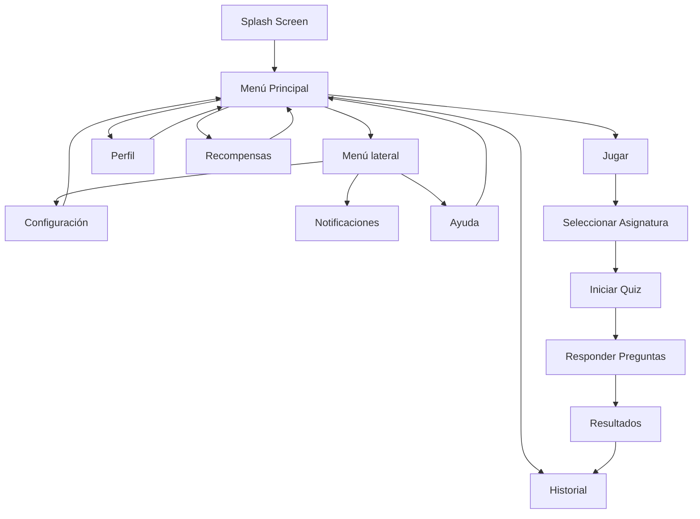

# STUDYPLAY
### Motivar el aprendizaje mediante una experiencia interactiva y gamificada, facilitando el estudio en distintas áreas académicas.

StudyPlay es una aplicación móvil que transforma el aprendizaje en una experiencia interactiva mediante gamificación. Permite a los usuarios estudiar a través de trivias dinámicas, obtener recompensas y mejorar sus hábitos de estudio en cualquier lugar, abordando la desmotivación del aprendizaje tradicional mediante el uso de puntos, logros y progreso visual.

---

## CARACTERÍSTICAS PROPIAS DEL MÓVIL

* Notificaciones push (simuladas en maqueta)
* Acceso ubicuo (uso en cualquier momento y lugar)
* Interfaz táctil intuitiva
* Interacción dinámica mediante quizzes
* Navegación fluida entre pantallas
* Uso de recursos visuales (iconos, imágenes, tarjetas)

---

## HISTORIAS DE USUARIO

* Como estudiante, quiero responder quizzes para practicar mis conocimientos.
* Como estudiante, quiero recibir recordatorios para estudiar.
* Como estudiante, quiero ganar logros para motivarme.
* Como estudiante, quiero revisar mi historial de partidas.
* Como estudiante, quiero ver mi perfil y progreso.

---

## REQUERIMIENTOS FUNCIONALES (RF)

* RF1: El sistema debe permitir responder quizzes.
* RF2: El sistema debe mostrar resultados al finalizar.
* RF3: El sistema debe registrar el historial de partidas.
* RF4: El sistema debe mostrar logros y recompensas.
* RF5: El sistema debe permitir navegación entre pantallas.
* RF6: El sistema debe mostrar información del perfil del usuario.
* RF7: El sistema debe mostrar ayuda y soporte.

---

## REQUERIMIENTOS NO FUNCIONALES (RNF)

* RNF1: La aplicación debe ser responsiva.
* RNF2: Debe funcionar en Android.
* RNF3: La interfaz debe ser intuitiva.
* RNF4: Tiempo de respuesta rápido.
* RNF5: Arquitectura escalable y modular.

---

## ARQUITECTURA Y PATRONES

La aplicación sigue una estructura modular:

lib/
├── models/
├── ui/
│ ├── screens/
│ ├── widgets/
├── main.dart

Se utiliza el patrón de navegación basado en rutas Navigator.pushNamed y el patrón **Lista-Detalle** en el historial de partidas.

---

## TECNOLOGÍAS UTILIZADAS

* Flutter
* Dart
* Material Design

---

## NAVEGACIÓN

La aplicación utiliza múltiples sistemas de navegación:

### Bottom Navigation Bar
* Historial
* Perfil

### Floating Action Button (centro)
* Iniciar juego (JUGAR)

### Drawer (menú lateral ☰)
* Perfil
* Configuración
* Notificaciones (simuladas)
* Ayuda y soporte

---

## PANTALLAS DE LA APLICACIÓN

* Splash Screen (inicio)
* Menú principal
* Selección de asignaturas
* Quiz
* Resultado de partida
* Historial (lista)
* Detalle de partida (detalle)
* Perfil de usuario
* Recompensas (logros)
* Configuración
* Ayuda y soporte

---

## GAMIFICACIÓN

La aplicación incluye un sistema de logros:

* Rachas de estudio (5, 10, 50 días)
* Logros por asignatura
* Progreso por cantidad de quizzes
* Logros bloqueados/desbloqueados

---

## MANUAL DE USO

### Menú principal
* Presionar "JUGAR" para iniciar un quiz
* Usar barra inferior para acceder a historial o perfil
* Usar menú lateral para opciones adicionales

### Quiz
* Seleccionar asignatura
* Responder preguntas
* Visualizar resultados

### Historial
* Ver partidas anteriores con:
  - Fecha
  - Tiempo
  - Dificultad
  - Asignatura
  - Respuestas correctas/incorrectas

### Recompensas
* Visualizar logros obtenidos
* Ver logros bloqueados

### Perfil
* Ver información personal
* Imagen de usuario
* Datos básicos

### Ayuda
* Preguntas frecuentes
* Información de soporte

---

## DIAGRAMA DE FLUJO

### AUTOR
* Renato León
#### Nuevo colaborador
* María José Paredes @MariaJoseParedes
